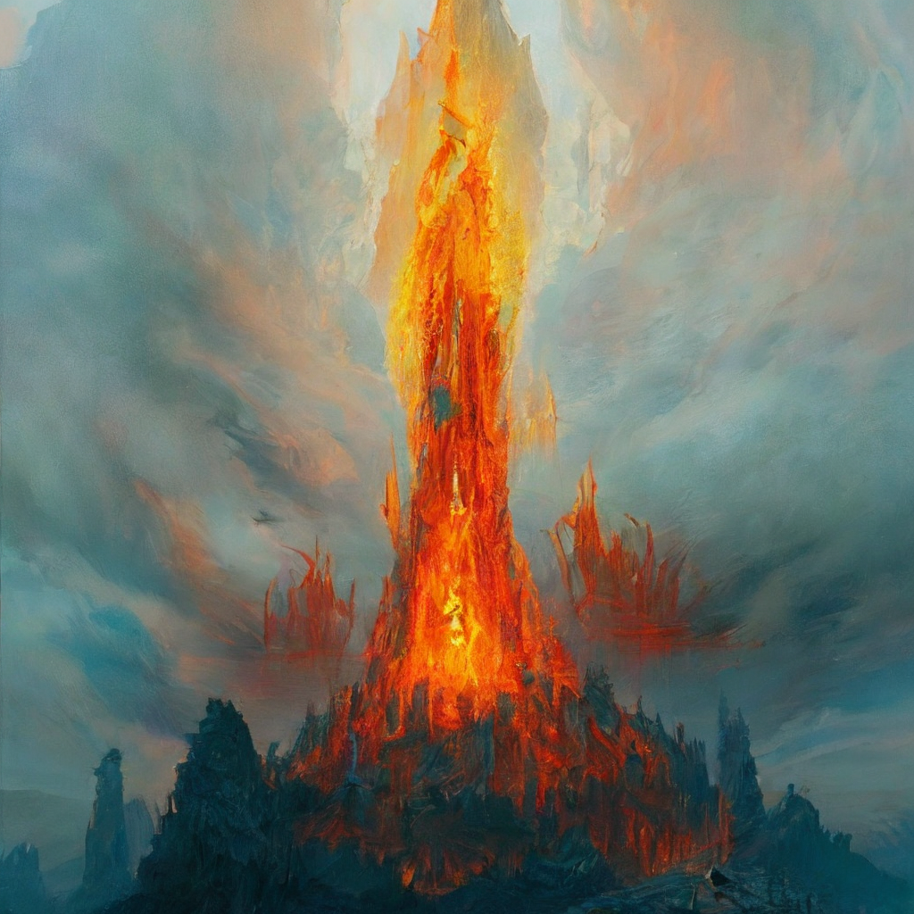

# Stable Diffusion Upscaler
This repository contains code converted in Python from [Stable Diffusion Upscaler Demo](https://t.co/aNqKfn1Mxl).  
Model by [RiversHaveWings](https://twitter.com/RiversHaveWings).  
Notebook by [nshepperd](https://twitter.com/nshepperd1).

You can increase the size of small images using stable diffusion upscaler.
| Before | After |
|-----------|-----------|
|      |      |

# Requirements
It can be executed by running the following commands.

```
git clone --recurse-submodules https://@github.com/Gekko0114/sd-upscaler.git
pip install -r ./sd-upscaler/requirements.txt
cd sd-upscaler && python ./src/main.py
```
# Examples
You can specify the image and prompt either by passing them as args or by modifying the config.yaml.

```
python ./src/main.py --input_image="https://models.rivershavewings.workers.dev/assets/sd_2x_upscaler_demo.png" --prompt="the temple of fire by Ross Tran and Gerardo Dottori, oil on canvas" --seed=1
```
